> # 🔖 목차
> ## ✨[프로젝트 소개](#-프로젝트-소개)
>
> ## 💡[기획 배경](#-기획-배경)
>
> ## 👫[대상](#-대상)
> 
> ## 🎉[기대 효과](#-기대-효과)
>
> ## 🔉[주요 기능](#-주요-기능)
>
> ## 🔧[기술 스택](#-기술-스택)
>
> ## 👥[팀원 소개](#-팀원-소개-및-역할-분담)
> 
> ## 📁[프로젝트 산출물](#-프로젝트-산출물)
>
> ## <a href="https://github.com/dh0728/ssafy_common_2/blob/master/README.md#%EF%B8%8F-%EC%84%9C%EB%B9%84%EC%8A%A4-%ED%99%94%EB%A9%B4-1">🖼️ 서비스 화면</a>
>

## ✨ 프로젝트 소개
### 친환경 클라우드 펀딩 플랫폼

## 💡 기획 배경
### 국내 환경에 대한 관심도 및 크라우드 펀딩 시장 규모 증가로 사업자는 친환경 상품 펀딩 사업을 전개 및 소비자는 관심있는 친황경 펀딩 상품을 구매할 수 있는 양방향 플랫폼 기획

## 👫 대상
### - 친환경 상품에 관심 있는 소비자
### - 친환경 상품 펀팅 희망 사업자

## 🔉 주요 기능
- <h3>리얼 타임 모금액<h3>
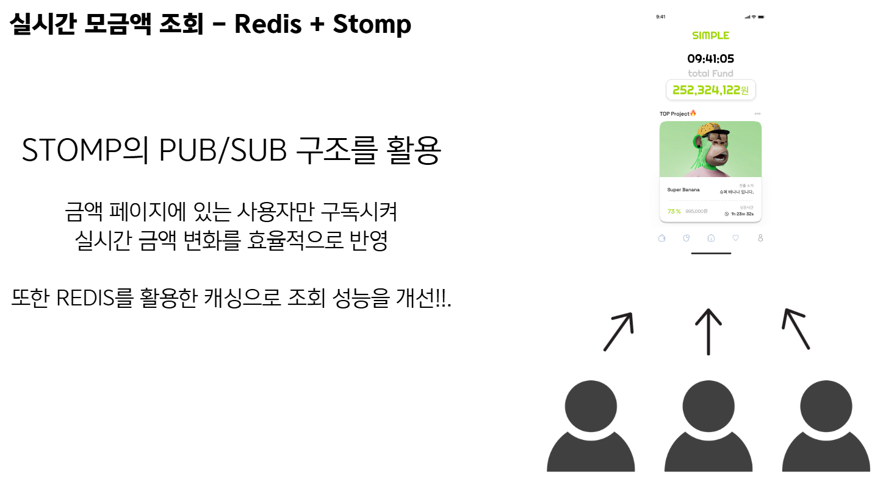

- <h3>펀딩 상품 단체 채팅방<h3>
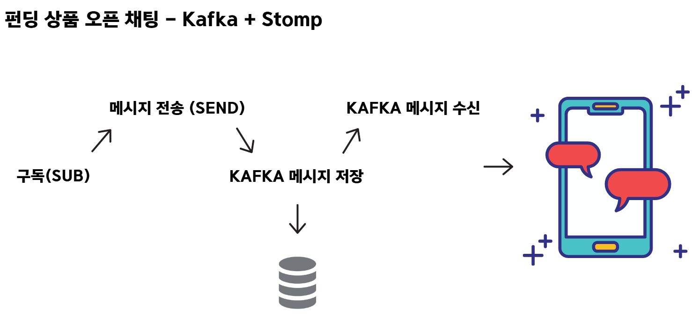

- <h3>구폰 발급<h3>
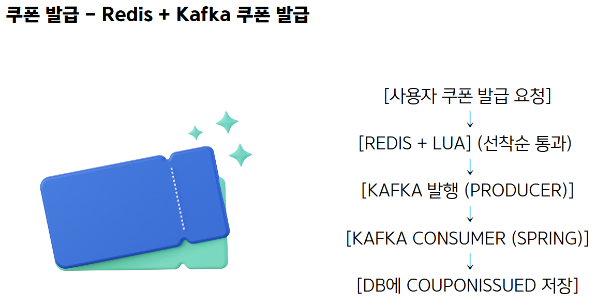

- <h3>자동 정산</h3>

## 🎉 기대 효과

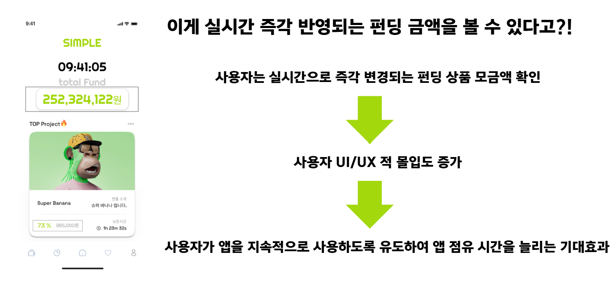
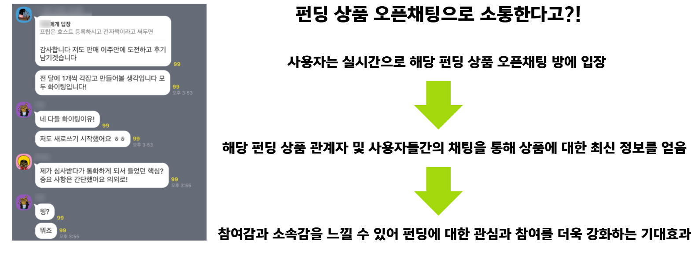

## 🔧 기술 스택

### FRONTEND

### BACKEND

### DB

### INFRA

### COLLABORATION TOOL

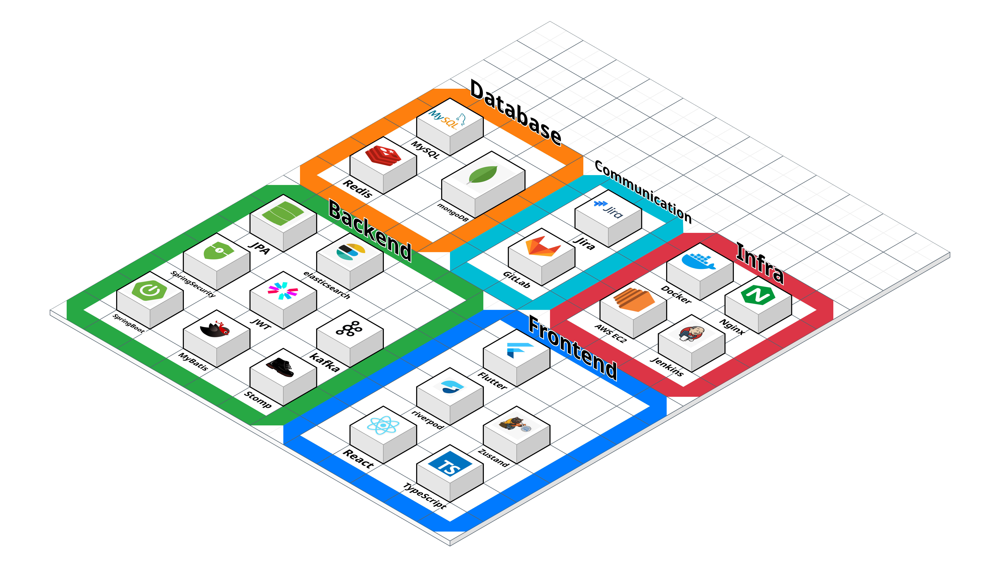

## 👥 팀원 소개 및 역할 분담

<table >
    <thead>
        <tr>
            <th align="center">도경록(팀장) - BE, Infra</th>
            <th align="center">김한민 - FE</th>
            <th align="center">도경원 - FE</th>
        </tr>
    </thead>
    <tbody>
        <td align="center">
            
        </td>
        <td align="center">
            
        </td>
        <td align="center">
            
        </td>
    </tbody>
</table>
<table >
    <thead>
        <tr>
            <th align="center">박수민 - BE</th>
            <th align="center">송동현 - BE</th>
            <th align="center">이지연 - BE</th>
        </tr>
    </thead>
    <tbody>
        <td align="center">
            
        </td>
        <td align="center">
            
        </td>
        <td align="center">
            
        </td>
    </tbody>
</table>

해당 프로필 사진을 클릭하면 해당 팀원의 깃허브로 이동합니다.

## 📁 프로젝트 산출물
<a href="https://www.figma.com/design/hQudFXOKxISWOBR9NSgvpj/wadiz?node-id=0-1&t=0YddF6nldQgbpSZf-1">
    <h2>Figma(링크)</h2>
</a>

<h2>Infra</h2>
<h3>MSA Infra Architecture</h3>

<h3>MSA Detail Flow</h3>
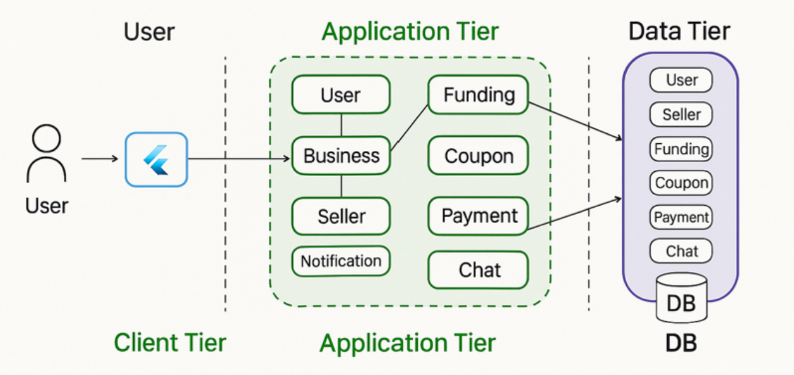

<a href="https://pinnate-fuel-130.notion.site/API-1b333f26c05b8045b58dfa9ed1aa3181">
    <h2>API 명세서(링크-노션)</h2>
</a>

<h2>ERD</h2>
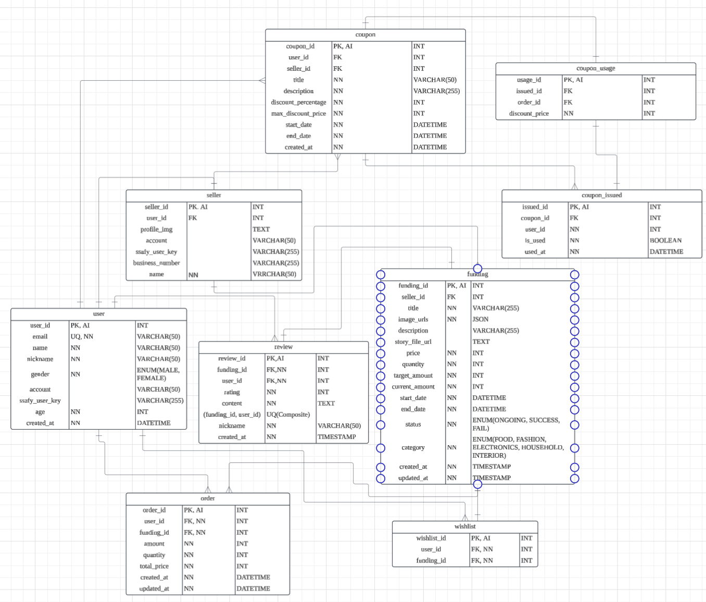

## 🖼️ 서비스 화면
<h2>소비자(사용자) - Mobile</h2>

<h3>📌메인(홈) 페이지</h3>

- 앱 시작 시 스플래시 스크린을 통해 앱 브랜딩의 미적 효과를 주는 동시에 데이터 로딩 시간 동안 빈 화면을 보여주지 않게 합니다.
- 이후 메인인 홈 페이지를 보여줍니다.
- 홈 페이지에서는 실시간으로 다른 사용자들이 결제를 할 경우 총 모금액의 변화를 실시간으로 홈 페이지에 있는 사용자에게 렌더링 없이 반영됩니다.

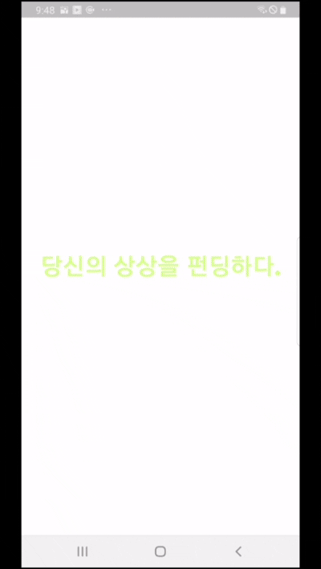

<h3>📌펀딩 페이지</h3>

- 펀딩 상품들의 목록을 보여주고, 해당 필터링 조건에 맞는 상품도 조회가능합니다.

- 선택한 해당 펀딩 상품에 대한 구체적인 정보를 보여줍니다.
- 사업자가 등록한 펀딩 상품 내용은 PDF 파일로 업로드하는 방식으로, 모바일 화면에서 PDF 뷰어를 통해 핸드폰 사이즈에 맞는 적절한 크기로 사용자에게 보여집니다.

- 해당 펀딩 상품을 등록한 사업자의 정보를 조회할 수 있습니다.
- 사업자가 해당 플랫폼에 등록한 모든 펀딩 정보를 한 눈에 알 수 있고, 각 상품들에 대한 리뷰 조회도 가능합니다.

- 사용자가 원하는 키워드의 펀딩 상품을 검색할 수 있습니다.
- Elasticsearch 를 이용하여 검색어 자동완성 기능도 구현되어 있습니다.
  
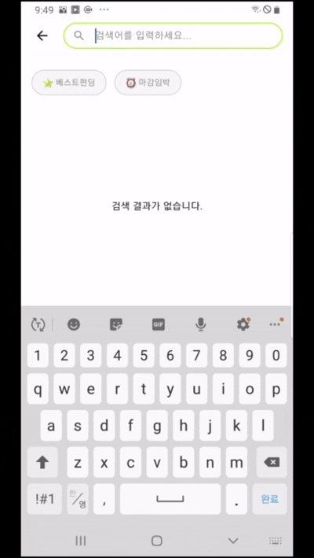

- 사용자는 해당 펀딩 상품을 결제할 수 있습니다.
- 이러한 결제 정보는 메인 페이지에 있는 사용자의 총 모금액 변화에 영향을 줍니다.

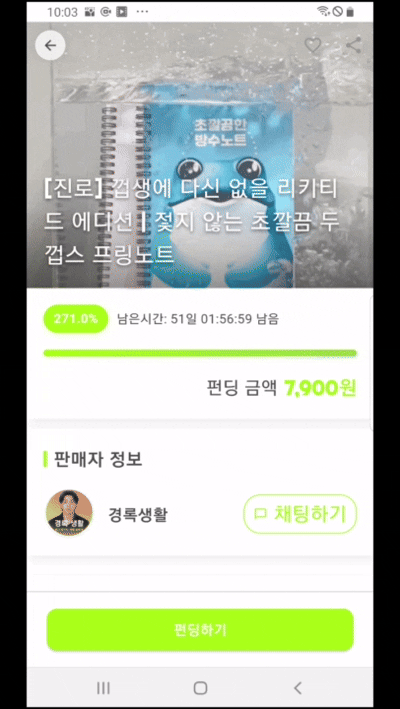

<h3>📌찜 페이지</h3>

- 사용자는 관심있는 펀딩 상품을 메인 페이지, 펀딩 페이지에서 해당 상품을 찜 할 수 있습니다.
- 자신의 찜 상품들은 찜 페이지에서 한눈에 볼 수 있습니다.

<h3>📌마이 페이지</h3>

- 사용자는 자신이 구매한 펀딩 상품들을 조회할 수 있습니다.

- 사용자는 자신이 구매 및 해당 펀딩 상품의 성공률이 100% 이상으로 마감된 상품에 대한 후기를 작성할 수 있으며, 조회, 수정 및 삭제도 가능합니다.

- 사용자는 자신의 프로필을 수정할 수 있습니다.

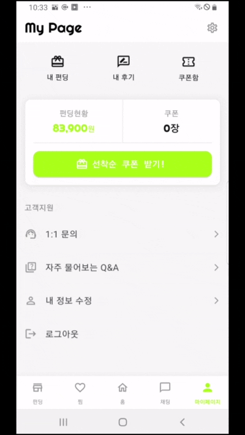

- 사용자는 매일 오전 10시에 발행되는 쿠폰을 선착순으로 발급받을 수 있습니다.
- 사용자는 해당 쿠폰을 구매하려는 펀딩 상품 금액에서 차감하여 구매할 수 있습니다. 

<h3>📌채팅 페이지</h3>

- 사용자는 각 펀딩 상품에 해당하는 오픈체팅방에 입장하여 여러 사용자들과 실시간으로 채팅을 주고받으며 의사소통 할 수 있습니다.

<h2>사업자(관리자) - WEB</h2>
<h3>📌사업자 로그인 페이지</h3>

- 사업자는 자신의 아이디로 로그인이 가능합니다.
- 승인을 통해 사업자 권한을 얻을 수 있습니다.
 
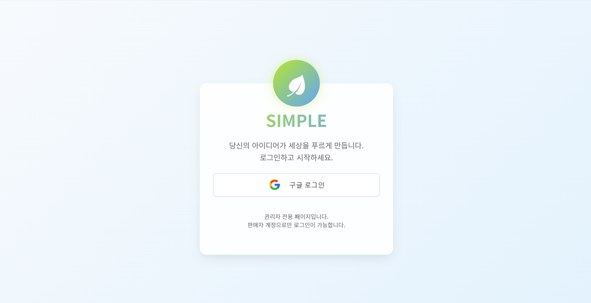

<h3>📌사업자 대시보드 페이지</h3>

- 사업자는 자신의 상품에 대한 간략한 정보 요약 및 통계를 확인할 수 있습니다.
 
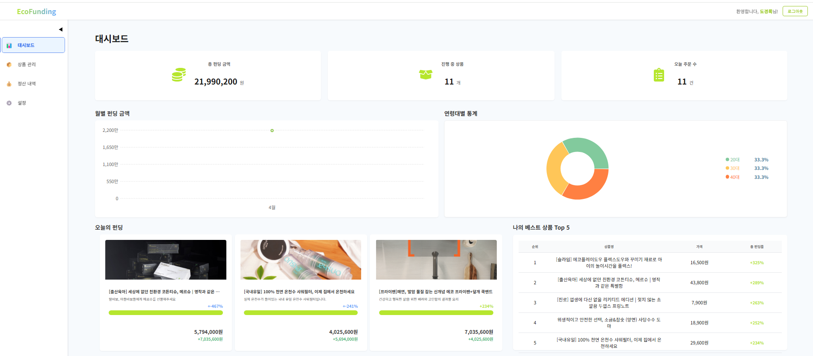
<h3>📌사업자 상품관리 페이지</h3>

- 사업자는 자신의 상품 목록을 조회할 수 있으며(진행중, 마감), 상품을 등록할 수 있습니다.
- 또한 상세한 상품의 정보 및 해당 상품의 통계 및 주문 현황을 조회할 수 있습니다.

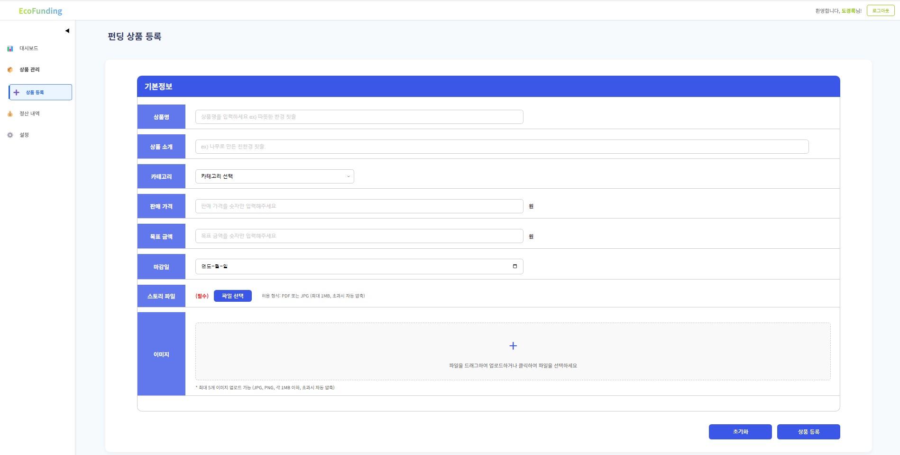
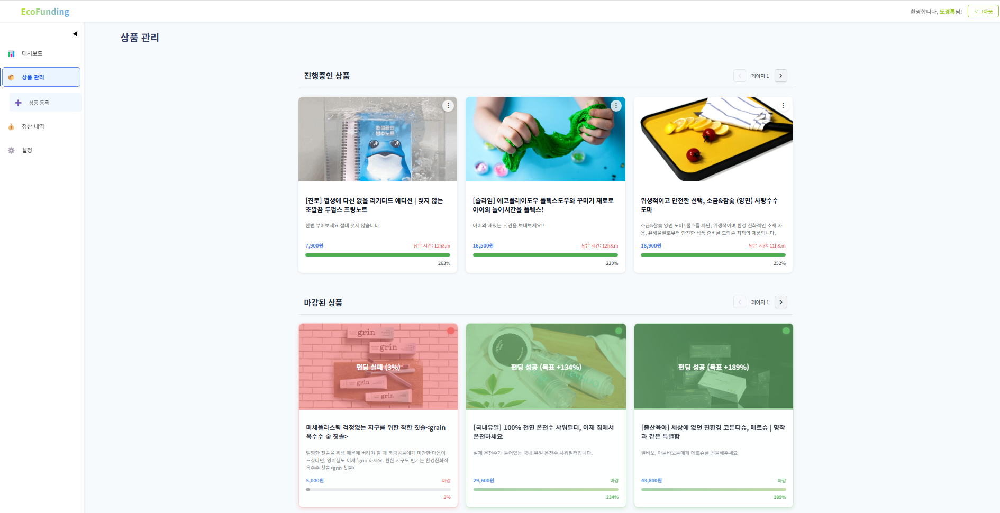
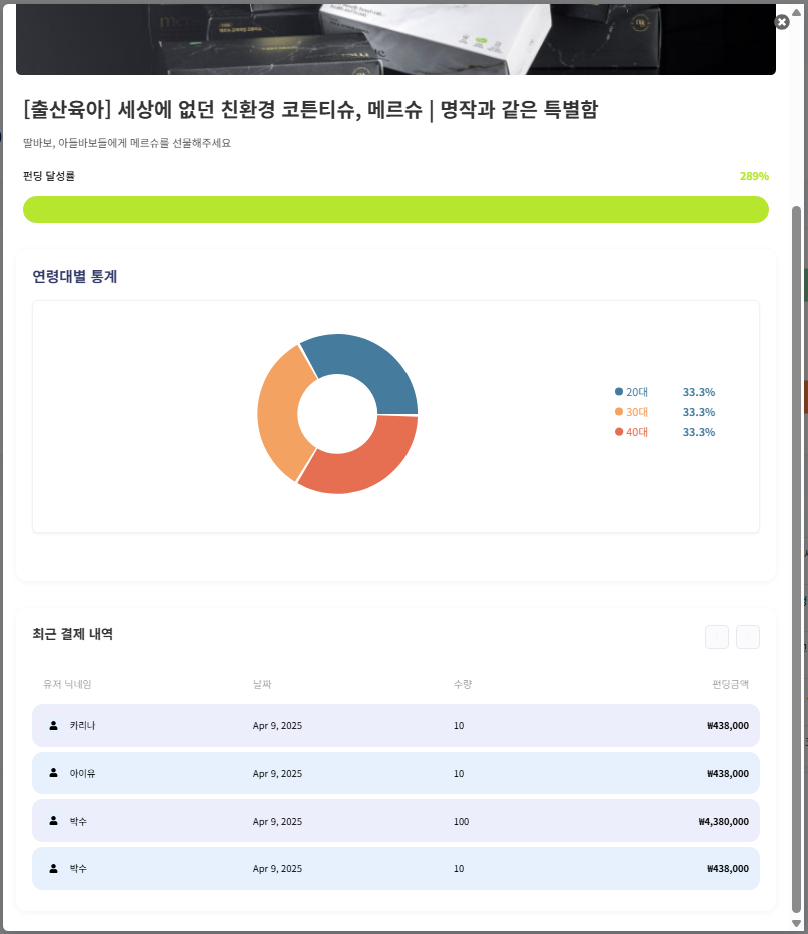

<h3>📌사업자 정산 페이지</h3>

- 사업자는 자신의 총 펀딩 금액 및 정산 예정중인 펀딩 상품의 금액을 조회할 수 있습니다.
- 정산은 00:00 시에 펀딩상품의 마감기한 내에 펀딩률을 100% 이상을 달성한 금액만큼 정산이 이루어집니다.
- 정산된 금액은 내역에서 조회할 수 있습니다.

<h4>정산 전</h4>
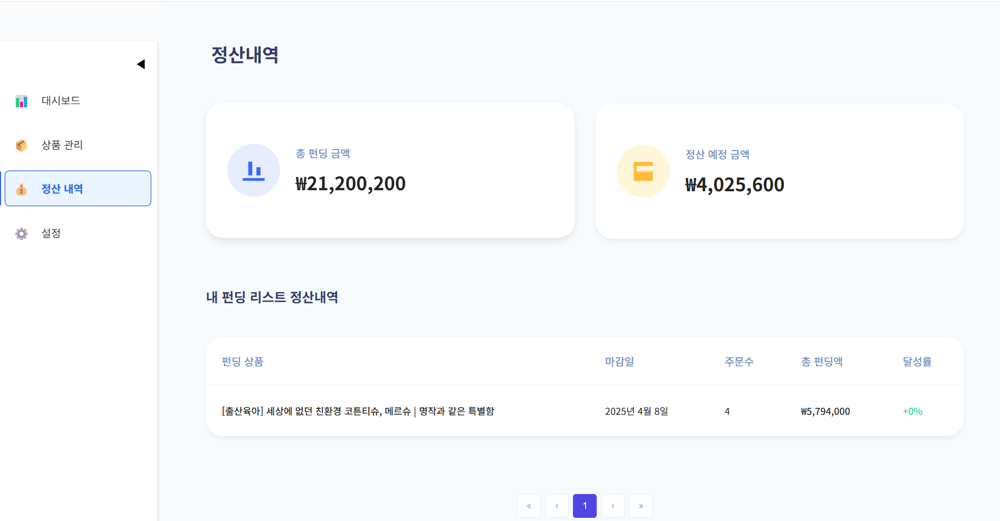
<h4>정산 후</h4>
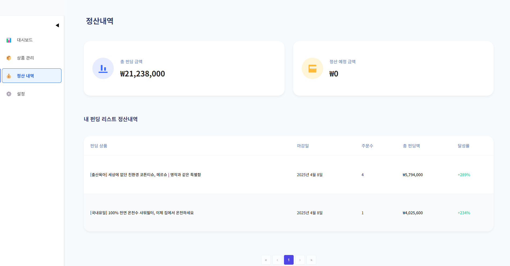

