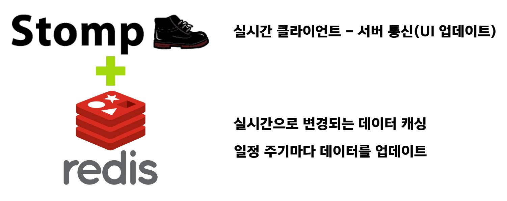
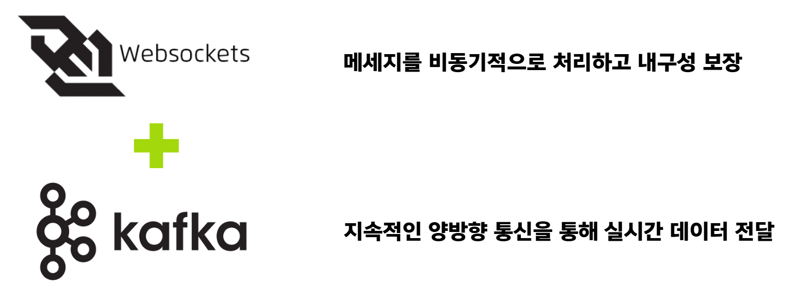

> # 🔖 목차
> ## ✨[프로젝트 소개](#-프로젝트-소개)
>
> ## 💡[기획 배경](#-기획-배경)
>
> ## 👫[대상](#-대상)
> 
> ## 🎉[기대 효과](#-기대-효과)
>
> ## 🔉[주요 기능](#-주요-기능)
>
> ## 🔧[기술 스택](#-기술-스택)
>
> ## 👥[팀원 소개](#-팀원-소개-및-역할-분담)
> 
> ## 📁[프로젝트 산출물](#-프로젝트-산출물)
>
> ## <a href="https://github.com/dh0728/ssafy_common_2/blob/master/README.md#%EF%B8%8F-%EC%84%9C%EB%B9%84%EC%8A%A4-%ED%99%94%EB%A9%B4-1">🖼️ 서비스 화면</a>
>

## ✨ 프로젝트 소개
### 친환경 클라우드 펀딩 플랫폼

## 💡 기획 배경
### 국내 환경에 대한 관심도 및 크라우드 펀딩 시장 규모 증가로 사업자는 친환경 상품 펀딩 사업을 전개 및 소비자는 관심있는 친황경 펀딩 상품을 구매할 수 있는 양방향 플랫폼 기획

## 👫 대상
### - 친환경 상품에 관심 있는 소비자
### - 친환경 상품 펀팅 희망 사업자

## 🔉 주요 기능
- <h3>리얼 타임 모금액<h3>

- <h3>펀딩 상품 단체 채팅방<h3>

## 🎉 기대 효과

## 🔧 기술 스택

## 👥 팀원 소개 및 역할 분담

<table >
    <thead>
        <tr>
            <th align="center">도경록(팀장) - BE</th>
            <th align="center">김한민 - FE</th>
            <th align="center">도경원 - FE</th>
        </tr>
    </thead>
    <tbody>
        <td align="center">
            
        </td>
        <td align="center">
            
        </td>
        <td align="center">
            
        </td>
    </tbody>
</table>
<table >
    <thead>
        <tr>
            <th align="center">박수민 - BE</th>
            <th align="center">송동현 - BE</th>
            <th align="center">이지연 - BE</th>
        </tr>
    </thead>
    <tbody>
        <td align="center">
            
        </td>
        <td align="center">
            
        </td>
        <td align="center">
            
        </td>
    </tbody>
</table>

해당 프로필 사진을 클릭하면 해당 팀원의 깃허브로 이동합니다.

## 📁 프로젝트 산출물
<h2>Figma</h2>
<h3>로그인 페이지</h3>

### 메인 & 펀딩 페이지

### 구매 & 결제 페이지

### 찜 페이지

### 마이 페이지

<h2>Infra</h2>
<h3>MSA Architecture</h3>

<h3>MSA Detail Flow</h3>

<h2>ERD</h2>

<h2>ERD</h2>

## 🖼️ 서비스 화면

