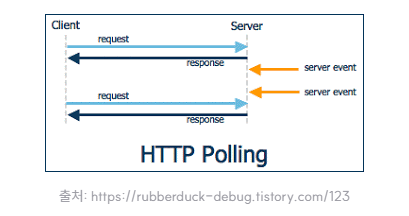
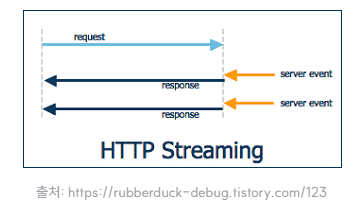
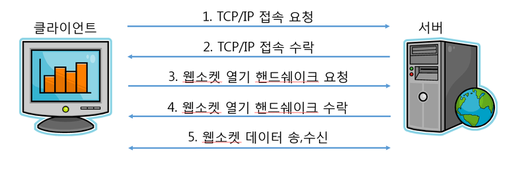
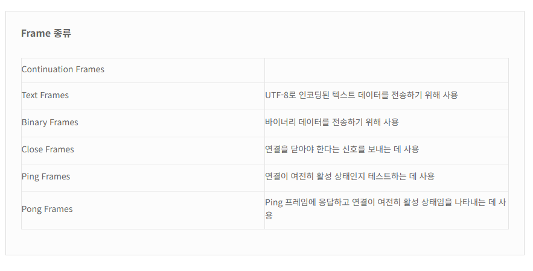

# 🌏 Web Socket

## 🌐 Socket이란?
- 프로그램이 네트워크에서 데이터를 주고받을 수 있도록 네트워크 환경에 연결할 수 있게 만들어진 연결부
- 데이터를 주고 받을 수 있는 구조체로 소켓을 통해 데이터 통로를 만든다.
- 서버 소켓, 클라이언트 소켓으로 구분된다. (요청하는 쪽이 클라이언트, 받는 쪽이 서버)
- TCP/IP, UDP/IP 유형이 존재하나 일반적으로 TCP/IP 프로토콜을 이용
- 소켓은 클라이언트와 서버가 데이터 패킷을 교환할 수 있도록 하는 IP 주소와 포트 번호라고 하는 통신용 끝점(End-Point)을 만들어 작동

## 🚀 동작 방식


### ☀️ Server

**socket()** : 소켓 생성(TCP는 stream)
    - 새로운 client 요청을 대기하기 위한

**bind()** : 사용할 IP address와 Port number을 등록
    - 포트 번호가 다른 소캣의 포트번호와 중복되지는 않을까?
    - 운영체제에서는 소켓들이 중복된 포트 번호를 사용하지 않도록, 내부적으로 포트 번호와 소켓 연결 정보를 관리
    
**listen()**: 연결 되지 않은 소켓을 요청 수신 대기 모드로 전환(Block 상태)

**accept()**: clinet의 요청dmf 수락 -> 통신을 위한 새로운 소켓 생성(실질적인 소켓 연결)


### 🌙 Client

**socket()**: 소켓 생성(TCP는 stream)

**connect()**: Client에서 Server와 연결하기 위해 소켓과 목적지 IP address, Port number 지정 (Block 상태)

### 🌟 Server-Client

**send(), recv()**: Client는 처음에 생성한 소켓으로, Server는 새로 반환(생성)된 소켓으로 client와 server간에 데이터 송수신
**close()**: 소켓을 닫음

## 🌏 Web Socket이란?
- 소켓은 두 컴퓨터 간의 통신을 설정하기 위한 기본 매커니즘을 제공하는 반면
- 웹소켓은 소켓 위에 구축되어 웹 클라이언트와 서버 간의 실시간 전이중 통신을 위한 상위 프로토콜을 제공하는 것이 차이점(웹 소켓은 HTTP 레이어에서 동작, 소켓은 TCP/IP) 
- HTTP로 실시간 통신을 하는 것이 어려웠기 때문에 해결책으로 나온 방식
- HTTP를 이용한 정보 송수신은 클라이언트의 요청이 없다면, 서버로부터 응답을 받을 수 없는 구조, 하지만 웹소켓에서는 서버와 브라우저 사이에 양방향 소통이 가능하다. 
- 클라이언트가 먼저 요청하지 않아도 서버가 먼저 데이터를 보낼 수도 있고, 사용자가 다른 웹사이트로 이동하지 않아도 최신 데이터가 적용된 웹을 볼 수 있게 해준다.

- 기본적으로 웹소켓 API는 아주 간단한 기능들만을 제공하기 때문에 대부분의 경우 SockJS나 Socket.IO같은 오픈 소스 라이브러리를 많이 사용하고 있으며 메시지 포맷 또한 STOMP같은 프로토콜을 같이 이용. 

```
기존의 단방향 HTTP 프로토콜과 호환되어 양방향 통신을 제공하기 위해 개발된 프로토콜
일반 Socket통신과 달리 HTTP 80 Port를 사용하므로 방화벽에 제약이 없으며 통상 WebSocket으로 불림
접속까지는 HTTP 프로토콜을 이용하고, 그 이후 통신은 자체적인 WebSocket 프로토콜로 통신
```


###  Web Socket을 사용하는 이유??

클라이언트와 서버가 통신할 때 HTTP 통신을 주로 사용한다. 
- 웹 소켓이 존재하기 전에는 Polling이나 Long Polling, Streaming등의 동작방식으로 해결

**polling**


- 클라이언트가 평범한 HTTP Request를 서버로 계속 요청해 이벤트 내용을 전달받는 방식. 
- 가장 쉬운 방법이지만 클라이언트가 지속적으로 Request를 요청하기 때문에 클라이언트의 수가 많아지면 서버의 부담이 급증
- HTTP Request Connection을 맺고 끊는 것 자체가 부담이 많은 방식이고, 클라이언트에서 실시간 정도의 빠른 응답을 기대하기 어렵다.

**Long polling**


- 클라이언트에서 서버로 일단 HTTP Request를 요청한다. 
- 이 상태로 계속 기다리다가 서버에서 해당 클라이언트로 전달할 이벤트가 있다면 그 순간 Response 메세지를 전달하며 연결이 종료된다. 
- 곧이어 클라이언트가 다시 HTTP Request를 요청해 서버의 다음 이벤트를 기다리는 방식. 
- polling보다 서버의 부담은 적으나, 클라이언트로 보내는 이벤트들의 시간간격이 좁다면 polling과 별 차이 없게 되며, 다수의 클라이언트에게 동시에 이벤트가 발생될 경우 서버의 부담이 급증한다.

**Streaming**


- Long Polling과 마찬가지로 클라이언트 -> 서버로 HTTP Request를 요청 
- 서버 -> 클라이언트로 이벤트를 전달할 때 해당 요청을 해제하지 않고 필요한 메세지만 보내기(Flush)를 반복하는 방식 
- Long Polling과 비교하여 서버에 메세지를 보내지 않고도 다시 HTTP Request 연결을 하지 않아도 되어 부담이 경감된다고 한다.

 

HTTP 통신은 다음과 같은 특징이 있다.

1. 비연결성 (connectionless) : 연결을 맺고 요청을 하고 응답을 받으면 연결을 끊어버린다.
2. 무상태성 (stateless) : 서버가 클라이언트의 상태를 가지고 있지 않는다.
3. 단방향 통신이다.

이러한 HTTP 통신의 경우 채팅과 같은 실시간 통신에 적합하지 않다.

물론 HTTP 통신으로 실시간 통신을 흉내낼 수는 있으나 완벽하지는 않다.
실시간 통신이 필요할 때 사용하는 통신을 소켓 통신이라고 한다.
HTTP 통신과 다르게 연결을 맺고 바로 끊어버리는 게 아니라 계속 유지를 하기 때문에 실시간 통신에 적합하다.


## 🚀 동작 방식
- 서버와 클라이언트간의 웹소켓 연결은 HTTP프로토콜을 통해 이루어진다. 연결이 정상적으로 이루어진다면 서버와 클라이언트 간에 웹소켓 연결(TCP/IP기반)이 이루어지고 일정 시간이 지나면 HTTP연결은 자동으로 끊어진다.
- 웹소켓을 이용하여 서버와 클라이언트가 통신을 하려면 먼저 **웹소켓 접속 과정**을 거쳐야 한다. 웹소켓 접속 과정은 **TCP/IP 접속** 그리고 **웹소켓 열기 HandShake 과정**으로 나눌 수 있다. 
- 웹소켓도 TCP/IP위에서 동작하므로, 서버와 클라이언트는 웹소켓을 사용하기 전에 서로 TCP/IP 접속이 되어있어야 한다. 
- TCP/IP 접속이 완료된 후 서버와 클라이언트는 웹소켓 열기 HandShake 과정을 시작한다.

```
WebSocket이 기존의 TCP Socket과 다른 점은 최초 접속이 일반 HTTP Request를 통해 HandShaking 과정을 통해 이뤄진다는 점이다.

HTTP Request를 그대로 사용하기 때문에 기존의 80, 443 포트로 접속을 하므로 추가 방화벽을 열지 않고도 양방향 통신이 가능하고, HTTP 규격인 CORS 적용이나 인증 등 과정을 기존과 동일하게 가져갈 수 있는 것이 장점이다.
```


🚨 핸드쉐이킹
- 주고받기는 정보기술과 전기통신 및 관련 분야에서 채널에 대한 정상적인 통신이 시작되기 전에 두 개의 실체 간에 확립된 통신 채널의 변수를 동적으로 설정하는 자동화된 협상 과정이다. 채널의 물리적인 확립이 잇따르며, 정상적인 정보 전송 이전에 이루어진다. (위키피디아)
- 두 호스트가 서로 연결할 때에 필요한 정보들을 주고받는 일련의 과정




### 클라이언트의 요청 헤더
```
GET /chat HTTP/1.1
Host: example.com:8000
Upgrade: websocket
Connection: Upgrade
Sec-WebSocket-Key: dGhlIHNhbXBsZSBub25jZQ== Sec-WebSocket-Version: 13
```
- Method: 반드시 GET 요청으로 보내야 함.
- Host: 웹소켓 서버의 주소
- Upgrade: 현재 프로토콜에서 다른 프로토콜로 업그레이드, 변경하기 위함(webSocket 프로토콜로 변환)
- Connection: Upgrade 필드가 명시되어있다면, Connection 필드도 명시해줘야 함.
- Sec-WebSocket-Key: 길이가 16 바이트인 임의의 값으로 클라이언트와 서버가 신원을 인증하는데 사용

이외에도 클라이언트는 여러 메세지나 서브프로토콜을 추가해 보낼 수도 있다. (User-Agent, Referer, Cookie 등) 원하는 대로 요청에 무엇이든지 첨부하여 보낼 수 있지만 웹소켓과 관련이 없을 경우 무시한다.

### 서버의 응답 헤더
```
HTTP/1.1 101 Switching Protocols
Upgrade: websocket
Connection: Upgrade
Sec-WebSocket-Accept: s3pPLMBiTxaQ9kYGzzhZRbK+xOo=
```
- 101 Switching Protocols으로 응답이 오면 웹소켓이 연결되었다는 의미
- 클라이언트가 보낸 헤더가 잘못된 값을 가지거나 형식이 잘못된 헤더의 경우, 서버는 "400 Bad Request (en-US)" 응답을 보내 즉시 소켓을 종료시킨다.

이런 과정을 통해서 프로토콜이 **ws, wss(WebSocket)**으로 변환되면 frame을 사용하여 데이터를 교환할 수 있다.

### Frame
WebSocket의 데이터 교환에서 사용되는 가장 작은 단위의 데이터로 **헤더**와 **페이로드**로 구성되어 있다.

#### Frame Header
헤더는 일반적으로 길이가 2바이트이지만 대용량 페이로드의 경우 최대 14바이트까지 가능하다.

1. 첫 번쨰 바이트에 포함되는 정보
- **FIN**: 이것이 메시지의 마지막 조각인지 여부를 나타냅니다.
- **RSV1, RSV2, RSV3**: 확장에 사용할 수 있는 예약된 비트
- **Opcode**: 페이로드 유형 지정(예: 텍스트, 바이너리, 핑 등)

2. 두 번째 바이트 포함되는 정보(페이로드에 관함)
**Mask**: 페이로드 마스킹 여부 표시
**페이로드 길이**: 페이로드의 길이 지정

#### Frame Payload
- 페이로드에는 WebSocket 연결을 통해 전송되는 **실제 데이터가 포함**된다. 페이로드가 마스킹된 경우(헤더의 마스크 플래그로 표시됨) 헤더에도 포함된 마스킹 키와 XOR 처리된다.
- 페이로드의 길이는 헤더에 지정된 페이로드 길이에 따라 가변 길이일 수 있다.
    - 만약 페이로드 길이가 125바이트 이하이면 프레임에 직접 저장되고 125이상이면 페이로드 길이 필드는 126 또는 127로 설정되고 페이로드 실제 길이는 헤더 뒤에 오는 별도의 필드에 저장




### 출처
<a href="https://jjongbin.tistory.com/entry/Web-Socket-%EC%86%8C%EC%BC%93">[Web] Socket, WebSocket (소켓과 웹소켓)</a>
<a href="https://yuricoding.tistory.com/134">웹소켓 개념과 원리</a>

