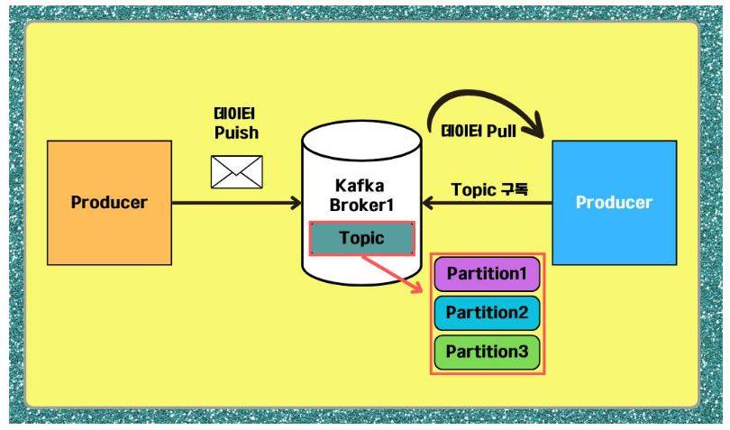

# 📢 Kafka
- Apache Kafka는 **고성능 분산 메시지 스트리밍 플랫폼**으로 대량의 데이터를 실시간으로 처리하고 전송하기 위해 설계
- LinkedIn에서 개발된 카프카(Kafka)는 2011년 오픈 소스로 공개되었으며, 현재 여러 기업과 개발자들 사이에서 널리 사용되고 있습니다.
- 카프카(Kafka)가 개발된 주된 이유는 
    1. 데이터의 흐름을 효율적으로 관리하고, 
    2. 다양한 시스템 간의 데이터 통신을 원활하게 하기 위함입니다. 
    3. 특히 대규모 데이터 환경에서 발생할 수 있는 문제, 예를 들어 데이터 손실, 지연, 복잡한 데이터 파이프라인 구축 등을 해결하기 위해 고안.
    
## 🔍 Kafka의 동작 원리

Kafka의 동작 원리를 이해하기 위해서는 먼저 **‘메시지 큐’**와 **‘Pub/Sub 모델**’이 무엇인지 알아야 함 
- 두 구조는 데이터 흐름의 효율성을 높이고, 시스템 간의 결합도를 낮춰 각 시스템이 독립적으로 작동할 수 있도록 돕고. 
- 이를 통해 대규모 시스템에서 데이터 전송과 처리의 복잡성을 줄일 수 있습니다.

### Message Queue
- 분산 환경에서 시스템 간 데이터를 교환하기 위해 사용되는 통신 기법
- **데이터 생산자와 소비자 간의 비동기적 통신을 가능하게 하는 시스템**

- 메시지는 Queue에 저장되며, 소비자는 필요할 때 이 메시지를 읽어들여 처리할 수 있음 
- 카프카(Kafka)는 이러한 메시지 큐의 기능을 강화하여 수많은 소비자가 동시에 데이터를 소비할 수 있도록 설계.

메시지 큐의 한계는 Producer(또는 Publisher)가 발행한 메시지를 보관하고 있는 큐에서 소비자가 메시지를 사용했을 때 다른 소비자는 해당 메시지를 재사용 할 수 없다는 것인데 이러한 한계를 해결하기 위해 카프카(Kafka)는 **Pub/Sub 모델을 활용**했습니다.

### Pub/Sub 모델
- **메시지 큐에서 제한된 메시지 재사용의 한계점을 해결해 주는 모델**
- 데이터 생산자와 소비자 간의 느슨한 결합을 가능하게 해주며 
- **메시지를 1:1로 직접 송수신하지 않고 중앙 중계 시스템을 통해 전달됩니다.**

- 발행자는 데이터(Message)를 특정 주제(Topic)에 발행하고, 주제(Topic)를 구독한 구독자에게 메시지를 전파
- Pub/Sub 모델을 통해 구독자는 관심 있는 주제만 구독하여 필요한 데이터를 수신 

## Kafka의 동작 방식과 구조

일반적인 메시지 큐는
- Broker가 특정 큐에 저장한 메시지를 소비자가 읽는 구조
- 데이터를 처리할 때 큐에 쌓인 메시지를 1명의 소비자가 처리

**Kafka**
- **분산 아키텍처를 기반**으로 하며, **각 Broker가 메시지를 저장하고 클러스터가 전체 메시지를 처리**
- 데이터는 Topic 별로 분류되고, 여러 파티션에 분산 저장된다는 점이 다르다.
- **분산 아키텍처(Partition)에서의 메시지 처리**는 여러 명의 소비자가 병렬로 처리할 수 있기 때문에 트래픽을 유동적으로 빠르게 처리 할 수 있습니다.

소셜 미디어 플랫폼에서 사용자가 좋아요를 누르거나 댓글을 달면 활동 로그를 추적해 알고리즘을 업데이트한다고 가정했을때의 Kafka 동작과정

- **Producer**: 사용자가 게시물에 좋아요를 클릭하거나 댓글을 달면 해당 이벤트가 Producer에 의해 생성됩니다. 이 이벤트 정보는 “활동 로그”라는 Topic에 발행됩니다.
- **Broker**: Broker는 이 이벤트 정보를 받아 “활동 로그” Topic의 파티션에 저장합니다. 여러 사용자로부터 발생하는 이벤트가 동시에 처리되므로 높은 처리량을 유지합니다.
- **Consumer**: “활동 로그” Topic을 구독하는 실시간 분석 시스템이나 추천 알고리즘을 실행하는 Consumer가 사용자 활동 데이터를 실시간으로 읽고, 이를 기반으로 추천 콘텐츠를 업데이트하거나 통계를 생성합니다.
이러한 방식으로 Kafka는 실시간 스트리밍 애플리케이션에서 데이터 흐름을 효율적으로 관리합니다. 각 구성 요소가 독립적으로 동작하기 때문에 확장성도 매우 높습니다.

### 출처
<a href="https://www.elancer.co.kr/blog/detail/738">[Apache Kafka] 대용량 트래픽 처리를 위한 카프카 사용법</a>
<a href="https://techblog.woowahan.com/17386/">우리 팀은 카프카를 어떻게 사용하고 있을까</a>